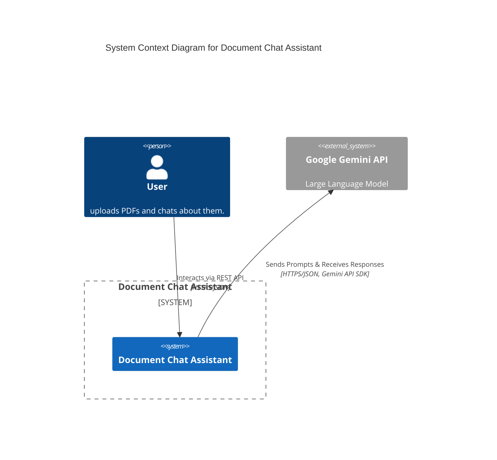
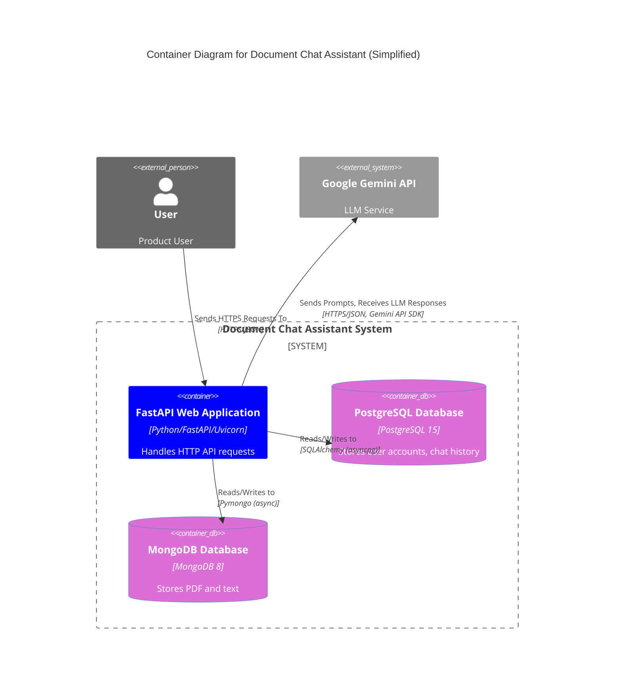
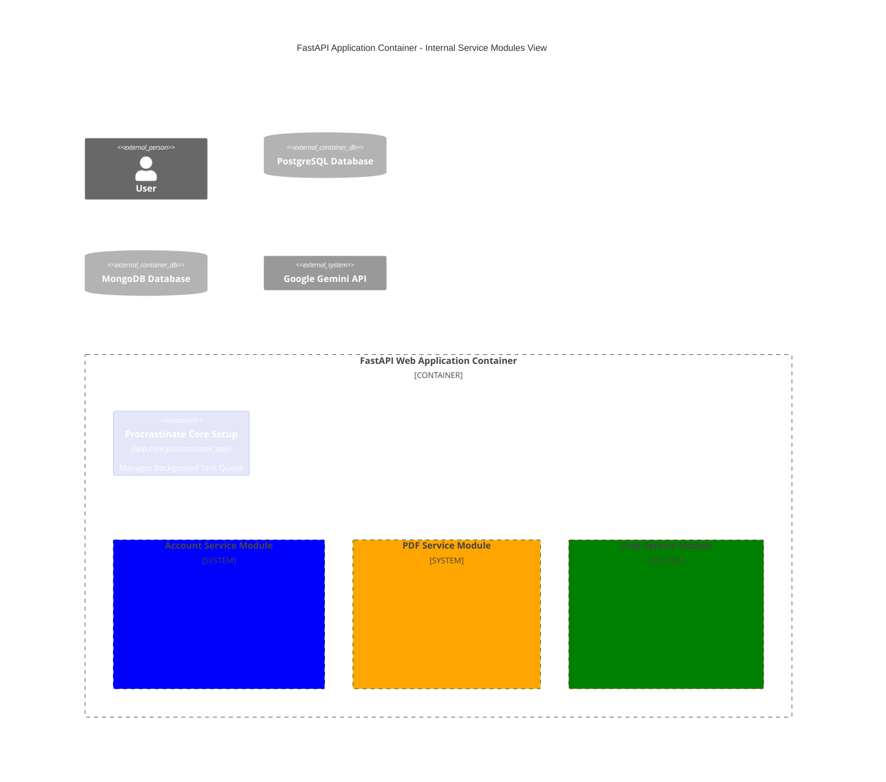
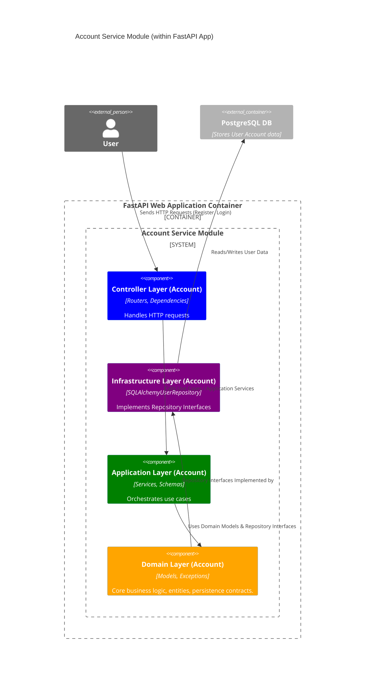
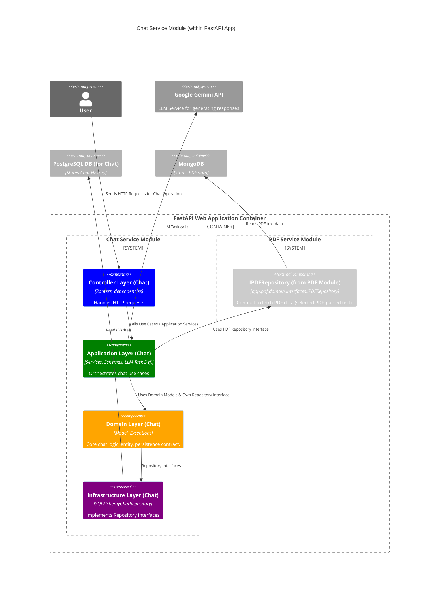
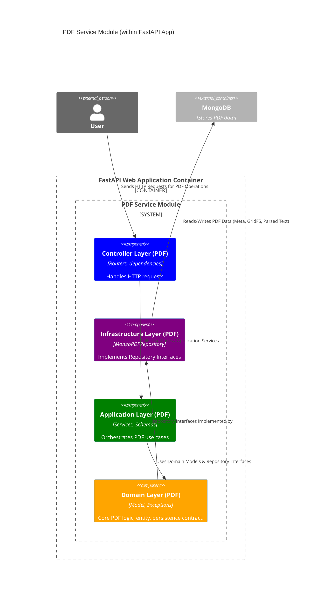

# Document Chat Assistant Architecture

This document describes the architecture of the Document Chat Assistant system, which allows users to upload PDF documents and chat about their content using a Large Language Model.

## System Context

The following diagram illustrates the system context, showing the main user and the external system it interacts with.

The **User** interacts with the **Document Chat Assistant** system by uploading PDF files and engaging in chat conversations about the document content. The Document Chat Assistant utilizes the **Google Gemini API** as the Large Language Model to process chat prompts and generate responses based on the uploaded documents.

## Container Diagram

The container diagram provides a higher-level view of the system, showing the main containers and their interactions.

The system consists of a **FastAPI Web Application** that serves as the main entry point for user interactions. It communicates with two databases: a **PostgreSQL Database** for storing user accounts and chat history, and a **MongoDB Database** for storing PDF documents and their parsed text content. The Web Application also interacts with the external **Google Gemini API** for LLM capabilities.

## FastAPI Application Internal Structure

The FastAPI Web Application is structured into several internal service modules, as shown in the diagram below.

The FastAPI application is organized into distinct service modules: Account, PDF, and Chat. It also includes core components for managing background tasks (Procrastinate).

### Account Service Module

The Account service module handles user registration and login. Its internal structure follows a layered architecture.

The **Controller Layer** handles incoming HTTP requests related to account management. The **Application Layer** orchestrates the use cases, utilizing the **Domain Layer** for core business logic and interacting with the **Infrastructure Layer** to persist data in the **PostgreSQL Database**.

### Chat Service Module

The Chat service module manages chat messages and history. It interacts with the Gemini API and both databases.

The **Chat Service Module**'s **Controller Layer** handles chat-related requests. The **Application Layer** orchestrates chat flows, interacting with the **Domain Layer**, the **Infrastructure Layer** (for PostgreSQL chat history), and the **PDF Service Module** (via the `IPDFRepository` interface) to access PDF data. It also makes calls to the **Google Gemini API** for generating chat responses.

### PDF Service Module

The PDF service module is responsible for handling PDF uploads, parsing, and selection.

The **PDF Service Module**'s **Controller Layer** handles PDF-related requests. The **Application Layer** orchestrates the PDF use cases, interacting with the **Domain Layer** and the **Infrastructure Layer** to store and retrieve PDF data (metadata, GridFS content, and parsed text) from **MongoDB**.

## Technologies Used

*   **FastAPI:** Web framework for building the API.
*   **Uvicorn:** ASGI server for running the FastAPI application.
*   **SQLAlchemy:** ORM for interacting with the PostgreSQL database.
*   **Psycopg:** PostgreSQL adapter for SQLAlchemy.
*   **Motor:** Asynchronous driver for MongoDB.
*   **PostgreSQL:** Relational database for user accounts and chat history.
*   **MongoDB:** Document database for storing PDF data and parsed text.
*   **Google Gemini API:** Large Language Model for chat functionality.
*   **Pydantic:** Data validation and settings management.
*   **Loguru:** Logging library.
*   **Procrastinate:** Background task queue.

## Data Models

*   **User Accounts:** Stored in the PostgreSQL database.
*   **Chat History:** Stored in the PostgreSQL database.
*   **PDF Data:** Stored in the MongoDB database, including metadata, the PDF file content (likely in GridFS), and the parsed text content.

## Key Features/Flows

*   **User Registration and Login:** Users can create accounts and log in to the system.
*   **PDF Upload and Processing:** Users can upload PDF files, which are then processed (parsed for text) and stored.
*   **PDF Selection:** Users can select a previously uploaded PDF to chat about.
*   **Chat Interaction:** Users can send messages and receive responses from the AI assistant based on the selected PDF's content.
